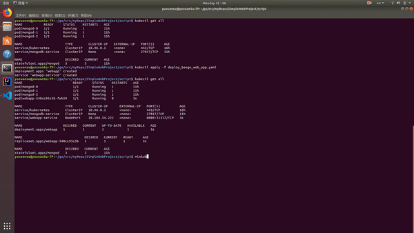

# SimpleWebProject: The To Do List  
This is a simple web project using vue.js + beego + MongoDB. Also, this web app is packaged as docker image and can by deployed on MiniKube.  

## Web App Preview:
This website can be used as a To Do List. User can do basic CRUD operations including adding tasks to the list, marking the task as completed, delete a existed task and query all the tasks' informations.  
  

## File Structure
```
/SimpleWebProject  
    +-- MongoDB (includes scripts needed to deploy MongoDB over Minikube)  
    +-- ToDoList (includes all the codes of beego web app)  
    +-- images (includes demo video)  
    +-- script (includes scripts needed to deploy beego web app over Minikube)  
```

## Instructions:
### Step 0. Prerequisites  
In order to use MiniKube, pls ensure the following dependencies are already fulfilled:  
1. The VirtualBox has been installed.  
2. The kubectl cli-tool has been installed.  
3. The MiniKube has been installed.  

### Step 1. deploy MongoDB on MiniKube
Here I follow instructions from the MongoDB official sites to deploy MongoDB Replica Set over MiniKube: https://github.com/pkdone/minikube-mongodb-demo    

1. clone my github Repo  
```
git clone git@github.com:BrefCool/SimpleWebProject.git
```

2. to deploy MongoDB service:  
```
cd SimpleWebProject/MongoDB/scripts
./generate.sh
``` 

3. Re-run the following command, until all 3 “mongod” pods (and their containers) have been successfully started (“Status=Running”; usually takes a minute or two).  
```
kubectl get all
```

4. Execute the following script which connects to the first Mongod instance running in a container of the Kubernetes StatefulSet, via the Mongo Shell, to (1) initialise the MongoDB Replica Set, and (2) create a MongoDB admin user (For simplicity, directly set the password to 'abc123').  
```
./configure_repset_auth.sh abc123
```

Now the MongoDB is ready to use.  

### Step 2. deploy beego web app on MiniKube
I have already make a docker image and push it to the Docker Hub: https://cloud.docker.com/u/syx525/repository/docker/syx525/todolist_web_app  

1. we will use yaml template to describe the Deployment, to deploy the web app, you only need to execute the folling command:
```
cd SimpleWebProject/scripts
kubectl apply -f deploy_beego_web_app.yaml
```
details of the yaml:  
```
apiVersion: apps/v1beta1
kind: Deployment
metadata:
  name: webapp
spec:
  template:
    metadata:
      labels:
        app: webapp
    spec:
      containers:
      - image: syx525/todolist_web_app
        name: todolist-web-app
        env:
        - name: DB_HOST
          value: mongodb-service
        - name: DB_PORT
          value: "27017"
        - name: DB_USER
          value: main_admin
        - name: DB_PASS
          value: abc123
        ports:
        - containerPort: 8080
```
In order to let this web app know the ip, user and password informations of the MongoDB service, here we specify the environment variable and pass it to container.  

2.  Expose the web app to the Host:   
I use a Nodeport type of Service to allow for inbound connections on the Minikube node to reach the web app Pod, so that we can reach the app from a terminal and from a browser on the Host:
```
apiVersion: v1
kind: Service
metadata:
  name: webapp-service
spec:
  type: NodePort
  ports:
    - nodePort: 31317
      port: 8080
      protocol: TCP
      targetPort: 8080
  selector:
    app: webapp
```
To query the Minikube ip:
```
minikube ip
```
You can directly visit the "minikube ip:31317" to get the website.

## Demo
  

To see the full video, pls visit `/images/demo.mp4` or see the video on YouTube: https://youtu.be/hLYLTeOr2sw  